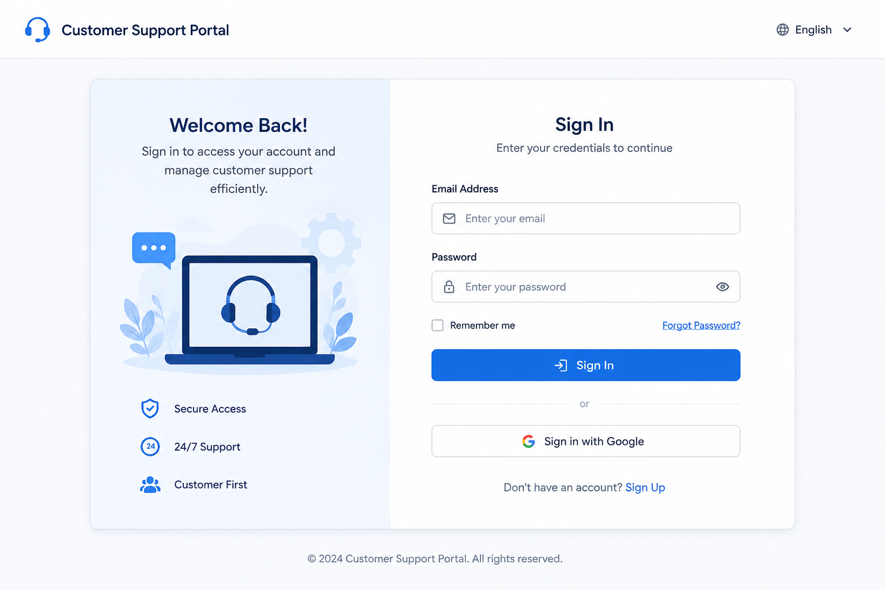

# Installation Guide
## Prerequisites

- Java 21
- Minimum 8 GB RAM
- Google Chrome version 125 or later
- Administrator privileges during installation
- Stable internet connection

## Installation steps

1. Download Installer. 
2. Run setup.
3. Restart the application. 

## Verification 

   Launch the application.

   Verify the Login page appears.

## Login Screen

   After completing the installation, verify that the Login page appears as shown below.

  
   

=======
## Supported Operating Systems
- Windows supported
- Linux supported
- macOS supported
>>>>>>> origin/master

## Troubleshooting

  If the installation fails:

- Verify that Java 21 is installed.
- Ensure you have administrator privileges.
- Check your internet connection.
- Restart the installer and try again.

## Java 21 not found 
> Make sure Java 21 is installed and configured correctly before running the application.

## Requirement
> java 21 is required for Installation.

ECHO is on.
